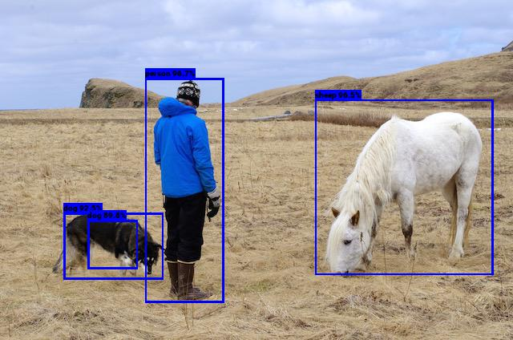
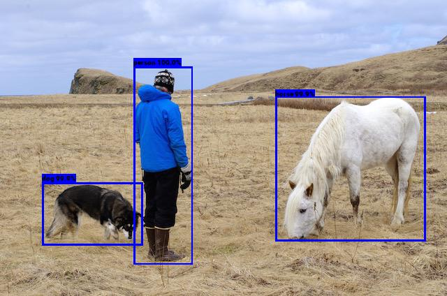

# Tensorflow YOLOv3

About
-----
> YOLOv3 and YOLOv3-Tiny Implementation for Real-Time Object Detection in Tensorflow

This is my first project in Computer Vision. I wanted to compare both YOLOv3 and YOLOv3-Tiny performance.

Later I will do a Transfer Learning for a future project.

Installation
------------
Run `make install`

Then download the official weights.

For YOLOv3:
```
curl https://pjreddie.com/media/files/yolov3.weights > ./weights/yolov3.weights
```

For YOLOv3-Tiny:
```
curl https://pjreddie.com/media/files/yolov3-tiny.weights > ./weights/yolov3-tiny.weights
```

Usage
-----
`python3 convert_weights.py [-h] [--tiny]`
* `-h`: Show help message and exit.
* `--tiny`: Convert tiny_weights from `"./weights/yolov3-tiny.weights"`. Default is to convert weights from `"./weights/yolov3.weights"`.

`python3 detect.py [-h] [--tiny] {video,image} iou confidence path`
* `-h`: Show help message and exit.
* `--tiny`: Enable tiny model mode.
* `{video, image}`: Detection mode (for file `path`).
* `iou`: IoU threshold between [0.0, 1.0].
* `confidence`: Confidence threshold between [0.0, 1.0].
* `path`: Path to file we want to do detection on.


Example
-------
First we convert weights for YOLOv3 model:
```
python3 convert_weights.py
```
Instructions for converting weights are in `./convert_weights.py`.

Then we can run detection for either an images:
```
python3 detect.py image 0.5 0.5 ./data/images/person.jpg
```

Or for a video:
```
python3 detect.py video 0.5 0.5 data/videos/champs-elysees.mp4
```

# YOLOv3-Tiny vs. YOLOv3
<div align="center">
  
  
</div>

<div align="center">
  
  
</div>

Bugs
----
The `YOLOv3-Tiny` boxes that use the smaller anchors have the right midpoint but sometimes the width / height seems off.

# Acknowledgments
[A Tensorflow implementation](https://www.kaggle.com/aruchomu/yolo-v3-object-detection-in-tensorflow)

[YOLOv3 Paper](https://pjreddie.com/media/files/papers/YOLOv3.pdf)

[Video Source](https://www.youtube.com/watch?v=3SS4iXpMVfk)

##### Project done in 2019
